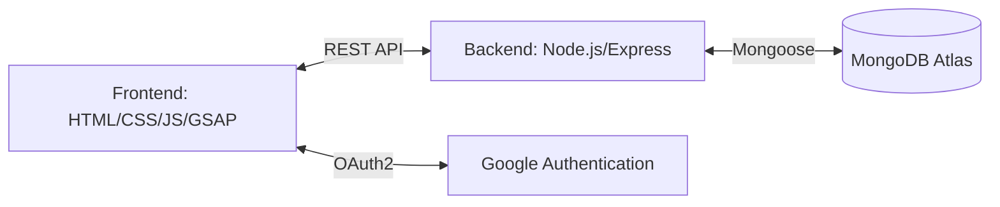

<div align="center">
  
  
  
  
  
  

  <br />
  <br />

  <h1>🛍️ NexBazaar</h1>
  <p>
    <b>A Premium, High-Performance Procurement Platform</b>
  </p>
  <p>
    Seamless administrative order processing meets a cinematic 3D browsing experience.
  </p>
</div>

<hr />

## 📖 Overview

**NexBazaar** is a next-generation e-commerce and procurement platform built to deliver an exceptionally fluid, visually striking user experience. Designed with a clear separation of concerns, the platform features a dedicated Customer portal for an immersive shopping experience, alongside a robust Administrator dashboard for precise order processing, inventory management, and real-time status tracking.

Whether you're a buyer seeking a cinematic product catalog or an administrator orchestrating complex procurement workflows, NexBazaar guarantees security, performance, and aesthetic excellence.

## ✨ Key Features

- 🎨 **Cinematic UI/UX:** Premium product catalog powered by GSAP animations, glassmorphism, and responsive design for an immersive shopping journey.
- 🔐 **Secure Authentication:** Seamless Google OAuth integration via Passport.js, paired with JWT-based session management for rock-solid security.
- 👥 **Role-Based Architecture:** Intelligent routing distinguishing between `Customer` and `Administrator` privileges, ensuring robust access control.
- 🛠️ **Administrative Dashboard:** A specialized interface to easily manage product inventory, track user orders, and modify order statuses with persistent feedback messaging.
- 📦 **Real-Time Order Tracking:** Customers receive immediate, synchronized updates on their order status via their personalized history panel.

## 🏗️ System Architecture

NexBazaar is built on a modern **Node.js/Express** backend and a **Vanilla JavaScript/HTML/CSS** frontend, emphasizing speed and minimal dependency bloat on the client side. Data is persistently managed using **MongoDB** and **Mongoose**.



## 💻 Tech Stack

### Frontend
- **Languages:** HTML5, CSS3, JavaScript (ES6+)
- **Animation:** GSAP (GreenSock) for micro-interactions and smooth transitions
- **Architecture:** Custom Vanilla JS components, modular CSS structure

### Backend
- **Runtime Environment:** Node.js
- **Framework:** Express.js
- **Database & ORM:** MongoDB, Mongoose
- **Authentication:** Passport.js (Google Strategy), JSON Web Tokens (JWT)
- **Security:** CORS, Environment Variables (`dotenv`)

## 🚀 Getting Started

Follow these instructions to set up NexBazaar on your local machine for development and testing.

### Prerequisites

- [Node.js](https://nodejs.org/en/download/) (v16.x or later recommended)
- [MongoDB](https://www.mongodb.com/try/download/community) (running locally, or an active MongoDB Atlas cluster URI)
- A Google Cloud Console project configured with OAuth 2.0 Credentials (Client ID & Secret)

### 1. Backend Setup

1. **Navigate to the backend directory:**
   ```bash
   cd backend
   ```
2. **Install dependencies:**
   ```bash
   npm install
   ```
3. **Environment Configuration:**
   Copy the example environment file and fill in your credentials.
   ```bash
   cp .env.example .env
   ```
   *Make sure to configure your `MONGO_URI`, `JWT_SECRET`, and `GOOGLE_CLIENT_ID` / `GOOGLE_CLIENT_SECRET`.*
4. **Start the development server:**
   ```bash
   npm run dev
   ```
   *The API will be available on `http://localhost:5000` (or your configured port).*

### 2. Frontend Setup

1. **Navigate to the frontend directory:**
   ```bash
   cd frontend
   ```
2. **Start the local static server:**
   ```bash
   node serve.js
   ```
3. **Open the Application:**
   Visit `http://localhost:3000` in your web browser.

## 📂 Project Structure

```text
NexBazaar/
├── backend/
│   ├── config/       # Database and Passport configurations
│   ├── controllers/  # Business logic for routes
│   ├── models/       # Mongoose schemas (User, Product, Order, etc.)
│   ├── routes/       # Express route definitions
│   ├── server.js     # Entry point for the Node.js API
│   └── .env          # Environment variables
└── frontend/
    ├── public/
    │   ├── src/      # JavaScript components and utils
    │   ├── styles/   # Vanilla CSS modules
    │   ├── assets/   # Images, icons, and media
    │   └── index.html# Main entry point for the UI
    └── serve.js      # Custom Node.js static file server
```

## 🤝 Contributing

Contributions are welcome! If you'd like to improve NexBazaar, please fork the repository and create a pull request with your suggested changes. For major updates, please open an issue first to discuss what you would like to change.

## 📄 License

This project is licensed under the [MIT License](LICENSE).

<br/>
<div align="center">
  <sub>Built with ❤️ for a modern procurement experience.</sub>
</div>
